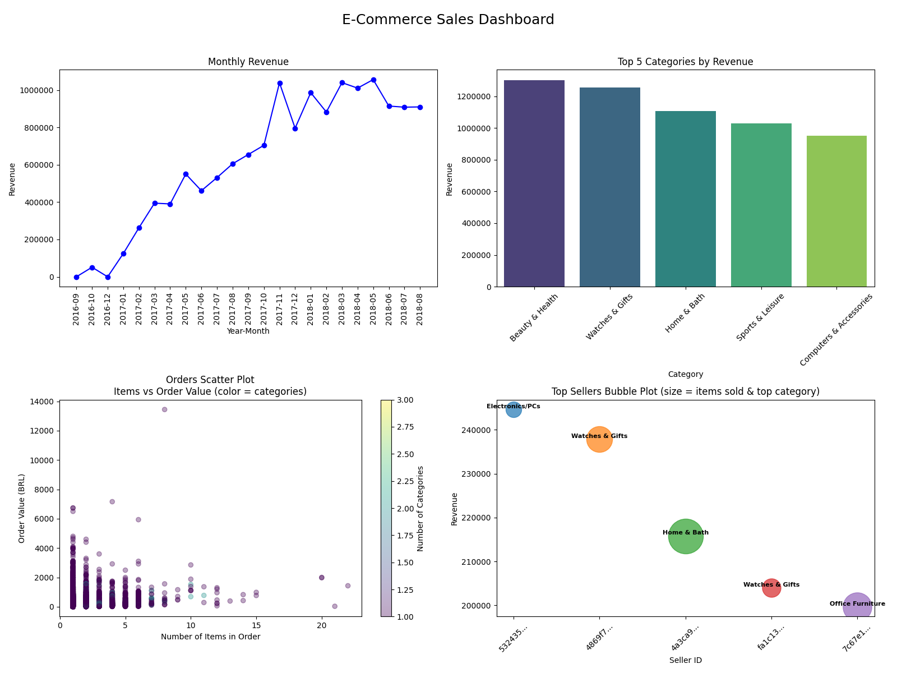

# Online Sales Analysis Dashboard

**Technologies:** Python, Pandas, Matplotlib, Seaborn
**Python Version:** 3.10+

## Description
This project analyzes online sales data from Olist to identify trends, key insights, and actionable recommendations for increasing revenue.
It includes data cleaning, aggregation, visualizations, and a 2x2 dashboard summarizing the most important metrics.

## Project Structure
- `data/` – raw and cleaned datasets
  - `cleaned/` – cleaned datasets ready for analysis
  - `analysis_results/` – aggregated tables used for reports and dashboard
- `scripts/` – Python scripts for generating reports and visualizations
- `reports/` – output insight report and dashboard

## Key Tasks
- **Data Cleaning & Preprocessing:** Handling missing values, correcting data types, and creating derived columns like `purchase_year_month`.
- **Sales Trend Analysis:** Monthly revenue trends, order counts, and category-level revenue.
- **Top Performers Analysis:** Identification of top products and sellers by revenue and items sold.
- **Visualization & Dashboard:**
  - Line plot of monthly revenue (up to August 2018)
  - Bar chart of top 5 categories by revenue
  - Scatter plot of orders (items vs order value, color = number of categories)
  - Bubble plot of top sellers (size = items sold, color = top category)
- **Insights Generation:** Key findings from sales patterns and customer behavior.
---

### Dashboard  Overview


---

## How to Run
1. Install dependencies:
```bash
pip install -r requirements.txt
```
2. Run the dashboard script:
```bash

python scripts/03_dashboard.py
```
## License
This project is for portfolio and educational purposes only.

